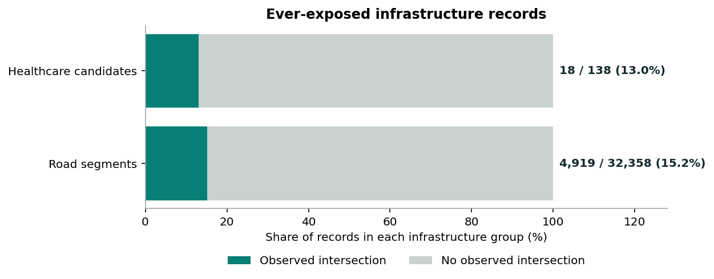
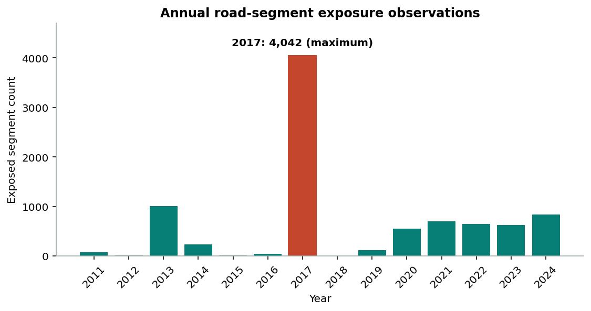
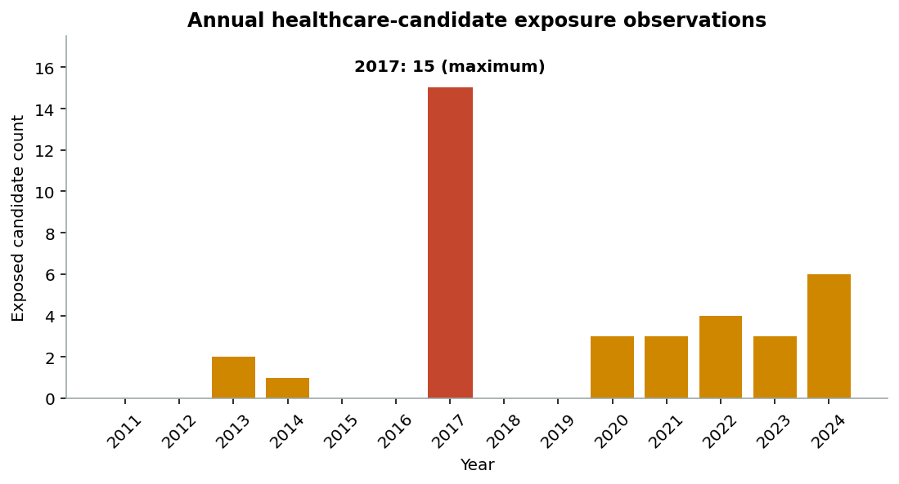
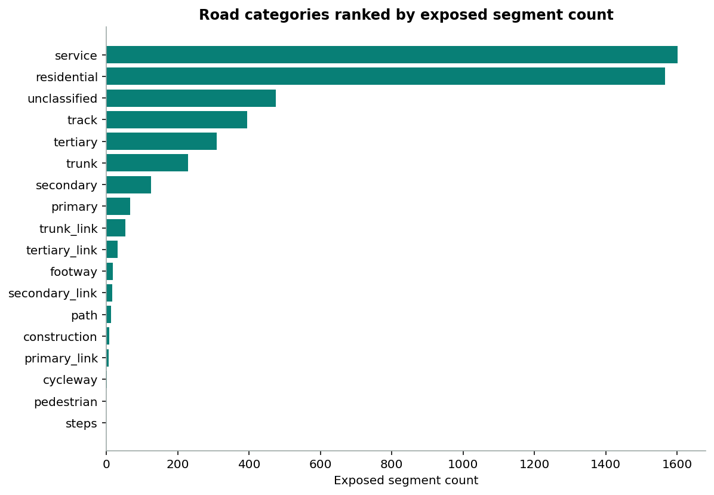
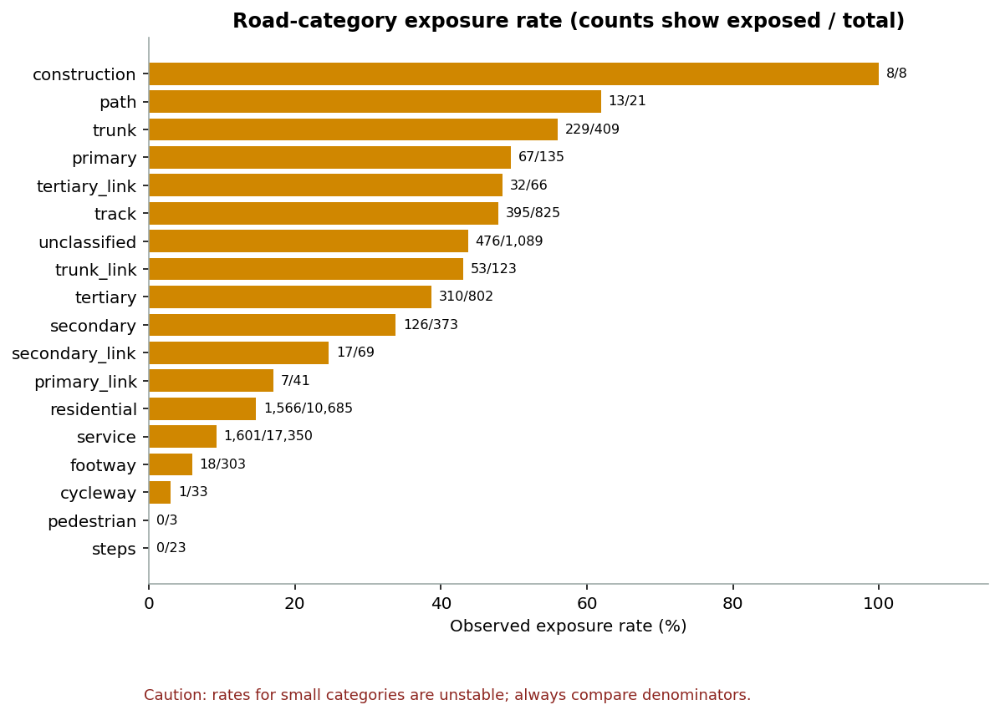

# Pattani Flood Exposure Intelligence

## Portfolio case study

### The question

How can historical flood geometry be combined with road and healthcare location data to identify exploratory infrastructure exposure patterns in Pattani—while preserving provenance and communicating uncertainty responsibly?

This project answers that question with a reproducible geospatial data pipeline and an exploratory local dashboard. It does not claim confirmed disruption, damage, accessibility, causation, prediction, risk, or exhaustive coverage.

## At a glance

| Dataset | Verified scale | Observed intersection |
|---|---:|---:|
| Historical flood features | 112,073 | Structural input |
| OSM road segments | 32,358 | 4,919 (15.2%) |
| Healthcare address-text candidates | 138 | 18 (13.0%) |

The maximum observed annual intersection count occurred in **2017**: **4,042 road segments** and **15 healthcare candidates**.

## What I built

1. **Secure, immutable ingestion:** credential-bearing source links are sanitized before publication, with separate hashes for original responses and stored artifacts.
2. **Deterministic validation and transformation:** source structure, pagination, lineage, counts, and hashes are verified before creating neutral processed outputs.
3. **Exploratory spatial analysis:** page-bounded indexes and exact geometry intersections compare flood polygons with clipped road segments and healthcare candidates.
4. **Temporal and category analysis:** annual observations for 2011–2024 and road-category summaries are reconciled to the verified snapshot.
5. **Communication layer:** a local read-only API, accessible dashboard, bounded spatial map, and this executable notebook expose findings without leaking source identifiers or credentials.

## Findings

### 1. Exposure was observed for a minority of infrastructure records

Geometric intersections were found for 4,919 of 32,358 road segments (15.2%) and 18 of 138 healthcare address-text candidates (13.0%). Roads are clipped segments rather than unique roads; healthcare rows are candidates selected from address text rather than verified facilities.

### 2. 2017 had the highest observed annual intersection counts

The annual values are separate observations. Infrastructure can appear in more than one year, so annual counts must not be summed as unique totals. The zero observed value in 2018 is not proof that no flooding occurred.

### 3. High counts and high rates tell different stories

Service and residential segments contribute the largest exposed counts because they are the largest observed categories. Some small categories have high percentages but very small denominators; these rates are unstable and should not be interpreted as broad network risk or road importance.

### 4. Source structure was internally consistent

For all 112,073 flood features, `freq` matched the sum of the 2011–2024 yearly fields. This is an **observed structural relationship only**. It does not establish provider-defined meaning, unit, causality, or an official contract.

## Technical approach

- **Python:** deterministic ingestion, validation, transformation, profiling, and reporting
- **Geospatial:** PyOsmium, Shapely, bounded spatial indexing, exact intersection checks
- **Data platform:** PostgreSQL 16 and PostGIS 3.5 for immutable aggregate publication
- **Product layer:** FastAPI, browser-native HTML/CSS/JavaScript, Canvas map, restrictive same-origin security controls
- **Quality:** synthetic offline tests, content hashes, append-only journals, no-overwrite publication, lineage reconciliation

The executable notebook is [`notebooks/pattani_flood_exposure_eda.ipynb`](../notebooks/pattani_flood_exposure_eda.ipynb). The local dashboard is available at `/dashboard/` after following the commands in [`docs/PHASE7_SPATIAL_MAP.md`](PHASE7_SPATIAL_MAP.md).

## Responsible interpretation

- Official GISTDA and DGA CRS evidence remains unresolved; spatial comparisons use the project's reviewed exploratory RFC 7946 interpretation.
- Road category labels do not establish drivability, condition, access, or importance.
- Healthcare candidates do not establish facility status, service availability, or complete coverage.
- Source coverage, positional accuracy, temporal alignment, ordering, and snapshot consistency remain uncertain.
- The Phase 7 map displays every exposed road segment but only a deterministic, non-representative subset of non-exposed context. Visual proportions are not prevalence; 15.2% remains the verified aggregate.
- No result is a prediction, operational alert, damage estimate, accessibility assessment, or risk score.

## Reproducibility

The notebook uses only repository-relative paths and verified aggregate outputs. It checks input byte counts and SHA-256 hashes against immutable manifests before analysis. Static charts contain no source records, coordinates, identifiers, credentials, or local paths. Generated source and processed datasets remain ignored by Git.

## Resume bullets

- Engineered a credential-safe, immutable geospatial pipeline for **112,073 flood features**, with deterministic pagination, content hashing, lineage journals, and offline verification across **1,000+ automated tests**.
- Integrated verified OSM road and public healthcare sources to analyze **32,358 road segments** and **138 healthcare candidates**, identifying exploratory geometric exposure for **4,919 segments (15.2%)** and **18 candidates (13.0%)**.
- Delivered an accessible local analytics product using **Python, Shapely, PostgreSQL/PostGIS, FastAPI, and browser-native Canvas**, with bounded payloads, transparent uncertainty, and reproducible 2011–2024 temporal reporting.
